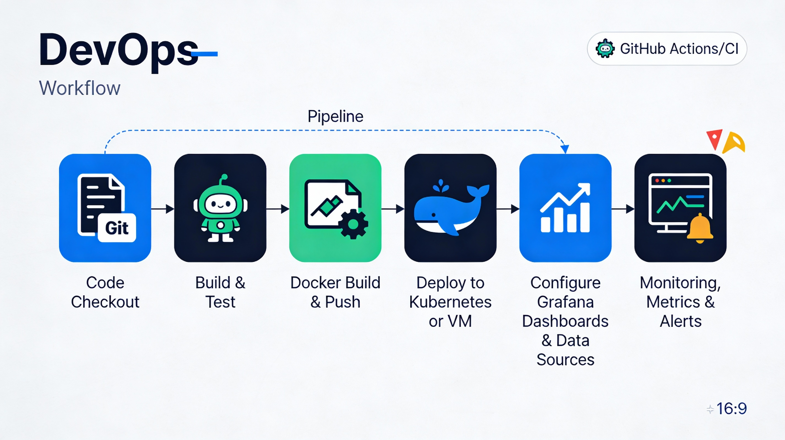

# 📊 DevOps Grafana Deployment Pipeline

> A complete, production-ready CI/CD pipeline for automated Grafana deployment, dashboard provisioning, and monitoring infrastructure setup.


---

## 🎯 Project Overview

This repository demonstrates a **complete DevOps implementation** showcasing:

✅ **Automated CI/CD Pipeline** – GitHub Actions for continuous integration and deployment  
✅ **Infrastructure Provisioning** – Docker & Kubernetes-ready deployment  
✅ **Grafana Automation** – Automated dashboard creation, data source provisioning, and alert configuration  
✅ **Monitoring Stack** – Prometheus integration for real-time metrics collection  
✅ **Best Practices** – Infrastructure as Code, GitOps workflows, and containerization  
✅ **Portfolio Showcase** – Production-grade DevOps pipeline implementation  

This project is **ideal for:**
- DevOps engineers building monitoring infrastructure
- Students learning CI/CD pipelines and observability
- Engineers preparing for DevOps interviews
- Teams implementing centralized monitoring solutions

---

## 📈 Pipeline Workflow

The complete end-to-end workflow from code commit to live monitoring:



### Workflow Stages:

| Stage | Description | Tools |
|-------|-------------|-------|
| **1. Code Commit** | Developer pushes code to GitHub repository | Git, GitHub |
| **2. CI Trigger** | GitHub Actions workflow automatically triggered | GitHub Actions |
| **3. Checkout & Build** | Code is checked out, dependencies resolved, app built | Bash, Docker |
| **4. Test & Validate** | Unit tests, linting, and security scans | GitHub Actions |
| **5. Containerize** | Docker image built and pushed to registry | Docker |
| **6. Deploy Application** | Deploy to Kubernetes cluster or Linux VM | Kubernetes/Docker Compose |
| **7. Configure Grafana** | Provision dashboards, data sources, and alerts | Grafana API, Provisioning |
| **8. Health Checks** | Validate deployment and Grafana connectivity | Bash Scripts |
| **9. Monitoring Live** | Metrics flow in, dashboards visualize, alerts trigger | Prometheus, Grafana |

---

## 🗂️ Repository Structure

```
devops-grafana-deployment-pipeline/
│
├── 📁 .github/
│   └── workflows/
│       ├── ci-pipeline.yaml              # Main CI/CD workflow
│       ├── deploy.yaml                   # Deployment workflow
│       └── grafana-provisioning.yaml     # Grafana automation workflow
│
├── 📁 deployment/
│   ├── kubernetes/
│   │   ├── grafana-deployment.yaml       # Grafana Kubernetes manifest
│   │   ├── grafana-service.yaml          # Grafana service definition
│   │   ├── prometheus-deployment.yaml    # Prometheus Kubernetes manifest
│   │   └── kustomization.yaml            # Kustomize configuration
│   │
│   ├── docker-compose.yaml               # Docker Compose for local testing
│   └── helm/                             # Helm charts (optional)
│
├── 📁 grafana/
│   ├── dashboards/
│   │   ├── system-metrics.json           # System performance dashboard
│   │   ├── application-metrics.json      # Application metrics dashboard
│   │   └── pipeline-metrics.json         # CI/CD pipeline metrics dashboard
│   │
│   ├── datasources/
│   │   └── prometheus-datasource.yaml    # Prometheus data source config
│   │
│   └── provisioning/
│       ├── dashboards.yaml               # Dashboard provisioning config
│       └── datasources.yaml              # Data source provisioning config
│
├── 📁 prometheus/
│   └── prometheus.yaml                   # Prometheus configuration
│
├── 📁 scripts/
│   ├── deploy.sh                         # Main deployment script
│   ├── health-check.sh                   # Health verification script
│   ├── setup-grafana.sh                  # Grafana setup script
│   └── cleanup.sh                        # Cleanup script
│
├── 📁 assets/
│   └── devops-workflow.png              # Workflow diagram
│
├── Dockerfile                            # Application Docker image
├── .gitignore
├── LICENSE
└── README.md                             # This file

```

---

## 🛠️ Tech Stack

### CI/CD & Automation
| Tool | Purpose | Badge |
|------|---------|-------|
| **GitHub** | Version control & repository hosting |  |
| **GitHub Actions** | CI/CD workflow automation |  |

### Containerization & Orchestration
| Tool | Purpose | Badge |
|------|---------|-------|
| **Docker** | Container runtime & image building |  |
| **Kubernetes** | Container orchestration (optional) |  |
| **Docker Compose** | Multi-container local development |  |

### Monitoring & Observability
| Tool | Purpose | Badge |
|------|---------|-------|
| **Grafana** | Metrics visualization & dashboards |  |
| **Prometheus** | Metrics collection & storage |  |

### Infrastructure & Scripting
| Tool | Purpose | Badge |
|------|---------|-------|
| **Linux/Bash** | Deployment & automation scripts |   |

---

## ⚡ Quick Start

### Prerequisites

Before starting, ensure you have:

- ✅ **Git** installed for version control
- ✅ **Docker** (v20.10+) for containerization
- ✅ **kubectl** (v1.24+) if deploying to Kubernetes
- ✅ **Helm** (v3.0+) for Kubernetes package management (optional)
- ✅ **Linux/macOS/WSL2** environment
- ✅ GitHub repository access with write permissions

### 1️⃣ Clone the Repository

```bash
git clone https://github.com/Rahulx0/devops-grafana-deployment-pipeline.git
cd devops-grafana-deployment-pipeline
```

### 2️⃣ Configure Environment Variables

Create a `.env` file in the root directory:

```bash
# Grafana Configuration
GRAFANA_ADMIN_USER=admin
GRAFANA_ADMIN_PASSWORD=your_secure_password_here
GRAFANA_HOST=localhost
GRAFANA_PORT=3000

# Docker Registry (if using private registry)
DOCKER_REGISTRY=docker.io
DOCKER_USERNAME=your_docker_username
DOCKER_PASSWORD=your_docker_token

# Kubernetes (if deploying to K8s)
K8S_NAMESPACE=default
K8S_CONTEXT=docker-desktop

# Prometheus
PROMETHEUS_PORT=9090
PROMETHEUS_RETENTION=15d
```

### 3️⃣ Deploy Locally with Docker Compose

For quick local testing:

```bash
# Navigate to deployment directory
cd deployment

# Start all services (Grafana + Prometheus)
docker-compose up -d

# Verify all containers are running
docker-compose ps
```

Access Grafana at: **http://localhost:3000**

Default credentials:
- Username: `admin`
- Password: (the password you set in `.env`)

### 4️⃣ Deploy to Kubernetes

For production-grade deployment:

```bash
# Create namespace
kubectl create namespace monitoring

# Apply Kubernetes manifests
kubectl apply -f deployment/kubernetes/ -n monitoring

# Verify deployments
kubectl get deployments -n monitoring
kubectl get services -n monitoring

# Port forward to access Grafana (if needed)
kubectl port-forward -n monitoring svc/grafana 3000:3000
```

### 5️⃣ Run Deployment Script

For automated deployment across environments:

```bash
# Make script executable
chmod +x scripts/deploy.sh

# Run deployment
./scripts/deploy.sh --environment production --enable-monitoring

# Run health checks
./scripts/health-check.sh
```

---

## 🚀 CI/CD Pipeline Details

### GitHub Actions Workflow

The CI/CD pipeline consists of three main workflows:

#### **1. CI Pipeline** (`.github/workflows/ci-pipeline.yaml`)

Triggered on every push to `main`, `develop`, and pull requests:

```yaml
Stages:
  ├── Checkout Code
  ├── Setup Environment
  ├── Lint & Format Check
  ├── Run Unit Tests
  ├── Build Docker Image
  ├── Push to Registry
  └── Notify Status
```

**Triggers:**
- Push to `main` branch
- Push to `develop` branch
- All pull requests
- Manual trigger via GitHub UI

#### **2. Deployment Pipeline** (`.github/workflows/deploy.yaml`)

Triggered after successful CI pipeline:

```yaml
Stages:
  ├── Deploy to Staging
  ├── Run Integration Tests
  ├── Deploy to Production
  ├── Health Check
  └── Slack Notification
```

**Triggers:**
- Successful completion of CI pipeline
- Manual approval required for production

#### **3. Grafana Provisioning** (`.github/workflows/grafana-provisioning.yaml`)

Triggered on changes to Grafana configuration:

```yaml
Stages:
  ├── Validate Dashboard JSON
  ├── Validate Data Source Config
  ├── Apply Dashboards via API
  ├── Apply Data Sources
  ├── Test Connectivity
  └── Alert Configuration
```

**Triggers:**
- Changes to `grafana/` directory
- Manual trigger
- Scheduled daily sync

---

## 📊 Grafana Configuration

### Automatic Dashboard Provisioning

Dashboards are automatically provisioned using Grafana's provisioning feature:

```yaml
# grafana/provisioning/dashboards.yaml
apiVersion: 1

providers:
  - name: 'Default'
    orgId: 1
    folder: ''
    type: file
    disableDeletion: false
    updateIntervalSeconds: 10
    allowUiUpdates: true
    options:
      path: /etc/grafana/provisioning/dashboards
```

### Data Source Configuration

Prometheus and other data sources are configured via:

```yaml
# grafana/datasources/prometheus-datasource.yaml
apiVersion: 1

datasources:
  - name: Prometheus
    type: prometheus
    access: proxy
    orgId: 1
    url: http://prometheus:9090
    basicAuth: false
    isDefault: true
    editable: true
```

### Available Dashboards

| Dashboard | Purpose | Metrics |
|-----------|---------|---------|
| **System Metrics** | CPU, Memory, Disk, Network | Node Exporter |
| **Application Metrics** | Request Rate, Latency, Errors | Custom App Metrics |
| **Pipeline Metrics** | Build Success Rate, Deployment Time | GitHub Actions API |

---

## 🧪 Testing & Validation

### Health Checks

Validate your deployment:

```bash
# Run comprehensive health check
./scripts/health-check.sh

# Check specific services
./scripts/health-check.sh --check grafana
./scripts/health-check.sh --check prometheus
./scripts/health-check.sh --check kubernetes
```

### Manual Testing

**Test Grafana Web UI:**
```bash
curl -X GET http://localhost:3000/api/health
```

**Test Prometheus Connectivity:**
```bash
curl -X GET http://prometheus:9090/api/v1/targets
```

**Test Dashboard Availability:**
```bash
curl -X GET http://localhost:3000/api/dashboards/uid/{dashboard-uid} \
  -H "Authorization: Bearer $GRAFANA_TOKEN"
```

### Automated Tests

All tests are run automatically in the CI pipeline:

```bash
# Run tests locally
pytest tests/
```

---

## 🔔 Alerts & Notifications

### Grafana Alerts

Configured alerts monitor:

- ✅ **CPU Usage** > 80%
- ✅ **Memory Usage** > 85%
- ✅ **Disk Space** < 10% free
- ✅ **Application Error Rate** > 5%
- ✅ **Pipeline Build Failures**
- ✅ **Service Downtime**

### Notification Channels

Alerts can be sent to:

| Channel | Configuration |
|---------|----------------|
| **Slack** | Webhook URL in `.env` |
| **Email** | SMTP settings in Grafana |
| **PagerDuty** | Integration key |
| **Webhook** | Custom endpoint |

---

## 🔐 Security Best Practices

### Secrets Management

All sensitive data is managed via GitHub Secrets:

```bash
# GitHub Secrets to configure:
GRAFANA_ADMIN_PASSWORD
DOCKER_USERNAME
DOCKER_PASSWORD
KUBERNETES_CONFIG
PROMETHEUS_API_TOKEN
SLACK_WEBHOOK_URL
```

### Access Control

- 🔒 **RBAC** enabled in Kubernetes
- 🔒 **Network Policies** restrict traffic
- 🔒 **Image Signing** for Docker images
- 🔒 **Regular Security Scans** in CI pipeline

### Credential Rotation

Secrets should be rotated:
- Every 90 days (passwords)
- Every 180 days (API tokens)
- Immediately if compromised

---

## 📖 Detailed Documentation

### Deployment Guides

- 🔗 [Docker Compose Deployment](docs/DOCKER_DEPLOYMENT.md)
- 🔗 [Kubernetes Deployment](docs/KUBERNETES_DEPLOYMENT.md)
- 🔗 [VM/Bare Metal Deployment](docs/VM_DEPLOYMENT.md)

### Configuration Guides

- 🔗 [Grafana Configuration](docs/GRAFANA_CONFIG.md)
- 🔗 [Prometheus Setup](docs/PROMETHEUS_CONFIG.md)
- 🔗 [GitHub Actions Workflows](docs/GITHUB_ACTIONS.md)

### Troubleshooting

- 🔗 [Common Issues & Solutions](docs/TROUBLESHOOTING.md)
- 🔗 [Performance Tuning](docs/PERFORMANCE.md)
- 🔗 [Logs & Debugging](docs/DEBUGGING.md)

---

## 🐛 Troubleshooting

### Common Issues

#### ❌ Grafana not accessible

```bash
# Check if container is running
docker ps | grep grafana

# Check logs
docker logs grafana

# Verify port binding
netstat -tlnp | grep 3000
```

**Solution:** Ensure port 3000 is not in use, restart container:
```bash
docker restart grafana
```

#### ❌ Prometheus data source connection failed

```bash
# Test Prometheus connectivity
curl http://prometheus:9090/api/v1/targets

# Check Prometheus logs
docker logs prometheus
```

**Solution:** Verify Prometheus is running and accessible at configured URL.

#### ❌ Dashboards not appearing

```bash
# Check provisioning config
ls -la grafana/provisioning/

# Validate JSON syntax
jq . grafana/dashboards/*.json
```

**Solution:** Ensure JSON files are valid and provisioning path is correct.

#### ❌ CI/CD Pipeline failing

```bash
# Check GitHub Actions logs in repository Settings > Actions
# Review workflow YAML syntax
yamllint .github/workflows/

# Test locally with act
act -j build
```

**Solution:** Review error messages in GitHub Actions logs, fix YAML, and retry.

---

## 📈 Monitoring the Pipeline

Monitor your DevOps pipeline itself:

### Pipeline Metrics Dashboard

The pipeline metrics dashboard tracks:
- 📊 Build success/failure rates
- ⏱️ Average build duration
- 🚀 Deployment frequency
- 🔄 Lead time for changes
- 🐛 Mean time to recovery (MTTR)

### Enable Pipeline Monitoring

```bash
# Collect GitHub Actions metrics
./scripts/collect-pipeline-metrics.sh

# This exports metrics in Prometheus format
# Scrape these metrics into Prometheus
```

---

## 🤝 Contributing

We welcome contributions! Here's how to get started:

### 1. Fork the Repository

```bash
git clone https://github.com/YOUR_USERNAME/devops-grafana-deployment-pipeline.git
cd devops-grafana-deployment-pipeline
```

### 2. Create a Feature Branch

```bash
git checkout -b feature/your-feature-name
```

### 3. Make Your Changes

- Follow existing code style
- Add tests for new features
- Update documentation

### 4. Commit with Clear Messages

```bash
git commit -m "feat: add new monitoring dashboard for API metrics"
```

### 5. Push to Your Fork

```bash
git push origin feature/your-feature-name
```

### 6. Open a Pull Request

- Describe your changes clearly
- Reference any related issues
- Wait for CI checks to pass

---

## 📚 Learning Resources

### DevOps & Monitoring

- 📖 [Prometheus Documentation](https://prometheus.io/docs/)
- 📖 [Grafana Documentation](https://grafana.com/docs/grafana/)
- 📖 [Kubernetes Official Docs](https://kubernetes.io/docs/)
- 📖 [GitHub Actions Guide](https://docs.github.com/en/actions)

### Best Practices

- 📖 [The Twelve-Factor App](https://12factor.net/)
- 📖 [SRE Book - Google](https://sre.google/books/)
- 📖 [DevOps Handbook](https://itrevolution.com/the-devops-handbook/)

### Interactive Learning

- 🎓 [Katacoda DevOps Scenarios](https://www.katacoda.com/)
- 🎓 [KodeKloud DevOps Labs](https://kodekloud.com/)

---

## 📊 Project Statistics

| Metric | Value |
|--------|-------|
| **Total Workflows** | 3 main + utilities |
| **Grafana Dashboards** | 3+ pre-configured |
| **Kubernetes Manifests** | 5+ ready to deploy |
| **Deployment Scripts** | 4 automation scripts |
| **Documentation Files** | 10+ guides |

---

## 📄 License

This project is licensed under the **MIT License** - see the [LICENSE](LICENSE) file for details.

You are free to:
- ✅ Use this project commercially
- ✅ Modify and distribute
- ✅ Use privately or publicly

Just give appropriate credit!

---

## 🙌 Author & Contact

**Rahul** 👨‍💻  
*DevOps Engineer | Cloud Architect | Monitoring Specialist*

### Connect

- 🔗 GitHub: [@Rahulx0](https://github.com/Rahulx0)
- 💼 Portfolio: [Your Portfolio URL]
- 📧 Email: [your.email@example.com]
- 🐦 Twitter: [@your_handle]
- 💬 LinkedIn: [Your LinkedIn Profile]

---

## ⭐ Show Your Support

If you found this project helpful, please consider:

- ⭐ **Star this repository** on GitHub
- 🔁 **Share** with your DevOps team
- 💬 **Leave feedback** in issues
- 🤝 **Contribute** improvements
- 📢 **Spread the word** on social media

---

## 📞 Support & Community

### Get Help

- 📝 [Open an Issue](https://github.com/Rahulx0/devops-grafana-deployment-pipeline/issues)
- 💬 [Start a Discussion](https://github.com/Rahulx0/devops-grafana-deployment-pipeline/discussions)
- 📧 Email: [support email]

### Community

- 👥 Join our [Discord Community](https://discord.gg/your-server)
- 📰 Follow our [Blog](https://your-blog.com)
- 🎬 Watch [YouTube Tutorials](https://youtube.com/your-channel)

---

## 🗺️ Roadmap

### Version 1.0 ✅
- [x] Basic CI/CD pipeline
- [x] Grafana deployment
- [x] Docker support
- [x] Documentation

### Version 1.1 🚀
- [ ] Kubernetes advanced features
- [ ] Multi-environment support
- [ ] Enhanced security scanning
- [ ] Cost optimization metrics

### Version 2.0 🎯
- [ ] Terraform IaC
- [ ] ArgoCD GitOps integration
- [ ] Advanced alerting
- [ ] Custom exporters

---

**Last Updated:** December 2025  
**Status:** ✅ Active & Maintained  
**Version:** 1.0.0

---

> **Made with ❤️ for the DevOps Community**
